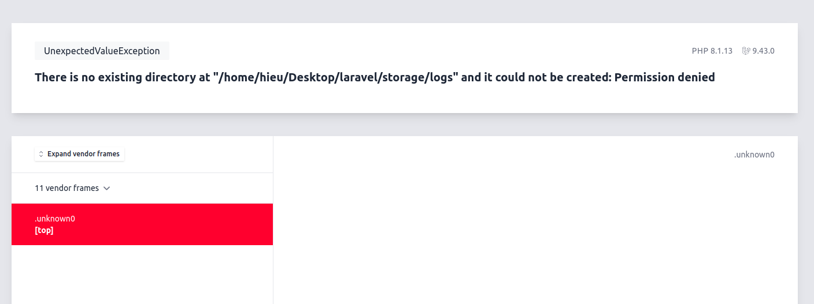
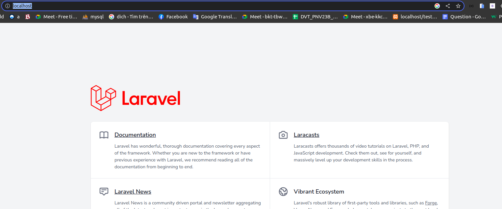

# Setup laravel #

## Clone source code from github ##

1. Clone source
   ```
    git clone git@github.com:Final-Graduation-PNV/final-graduation-be.git

    cd final-graduation-be
   ```
2. Install vender by compose
   ```
   docker run --rm -v $(pwd):/app composer install
   ```
3. Start docker-compose
    ```
    docker-compose up -d --build
    ```
4. Up date permission
   ```
   cd ../
   sudo chown -R $USER:$USER final-graduation-be
   cd final-graduation-be
   ```
5. Setup laravel
   ```
   cp .env.example .env
   ```
   add this content
   ```
    DB_CONNECTION=mysql
    DB_HOST=db
    DB_PORT=3306
    DB_DATABASE=laravel
    DB_USERNAME=dthanh
    DB_PASSWORD=DThanh1508
   ```
    and
    ```
   MAIL_MAILER=smtp
    MAIL_HOST=smtp.gmail.com
    MAIL_PORT=587
    MAIL_USERNAME=athanh2002kt@gmail.com
    MAIL_PASSWORD=jevgntagxhmbbihw
    MAIL_ENCRYPTION=tls
    MAIL_FROM_ADDRESS="cloud@api.com"
    MAIL_FROM_NAME="${APP_NAME}"
   ```
6. Access to app
   ```
    docker exec -it app bash
   ```
   generate new key
   ```
    php artisan key:generate
   ```
   open browser and test
   
   If this error
   ```
    docker exec -it app bash
    chmod o+w ./storage/ -R
    php artisan config:cache
    php artisan config:clear
   ```
   open browser at:
   ```
    http://localhost/
   ```
   It work
   
